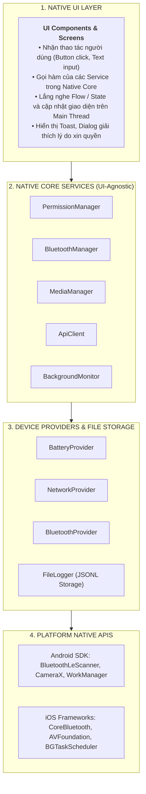

# Kiến trúc Native Core

## 1. Nguyên tắc cốt lõi: UI != Device Logic

Một trong những sai lầm phổ biến nhất khi mới lập trình Native là viết trực tiếp mã nguồn điều khiển phần cứng (quét Bluetooth, gọi API, đọc trạng thái pin) ngay trong [`Activity`](https://developer.android.com/reference/android/app/Activity)/[`Fragment`](https://developer.android.com/reference/androidx/fragment/app/Fragment) (Android) hoặc [`UIViewController`](https://developer.apple.com/documentation/uikit/uiviewcontroller)/[`UIView`](https://developer.apple.com/documentation/uikit/uiview) (iOS).

Trong dự án này, quy tắc tối thượng cần tuân thủ là:

> **UI chỉ chịu trách nhiệm nhận tương tác và hiển thị. Toàn bộ logic phần cứng và hệ thống phải nằm trong các Service độc lập có thể tái sử dụng.**



---

## 2. Phân định trách nhiệm rõ ràng

| Thành phần | Trách nhiệm được phép | Trách nhiệm bị CẤM |
| :--- | :--- | :--- |
| **Giao diện (UI)** | • Nhận tương tác (click, scroll, nhập chữ)<br>• Gọi hàm public của Service<br>• Hiển thị kết quả & render danh sách<br>• Hiển thị loader/spinner khi async | • KHÔNG gọi trực tiếp API hệ điều hành ([`BluetoothAdapter`](https://developer.android.com/reference/android/bluetooth/BluetoothAdapter), [`URLSession`](https://developer.apple.com/documentation/foundation/urlsession),...)<br>• KHÔNG tự xử lý mảng byte hay parse JSON phức tạp<br>• KHÔNG tự mở file đọc/ghi |
| **Dịch vụ (Service)** | • Gọi Native APIs hệ điều hành<br>• Xử lý callbacks / events / delegates<br>• Quản lý trạng thái thiết bị (Connected, Scanning, Idle)<br>• Xử lý ngoại lệ, timeout và format dữ liệu | • KHÔNG import hoặc giữ tham chiếu tới UI Component (tránh memory leak)<br>• KHÔNG can thiệp trực tiếp vào việc hiển thị |

---

## 3. Cấu trúc thư mục theo chuẩn nền tảng

### Cấu trúc Android (Kotlin)

Dự án Android được tổ chức tinh gọn:

```
android/
├── app/
│   ├── src/main/java/com/carmdconnect/devicemonitor/
│   │   ├── ui/                        # Giao diện người dùng
│   │   │   ├── MainActivity.kt
│   │   │   ├── BleAdapter.kt
│   │   │   └── ...
│   │   └── nativecore/                # Tầng dịch vụ lõi tái sử dụng
│   │       ├── permission/
│   │       │   └── PermissionManager.kt
│   │       ├── bluetooth/
│   │       │   ├── BluetoothManager.kt
│   │       │   └── BleDevice.kt
│   │       ├── media/
│   │       │   └── MediaManager.kt
│   │       ├── network/
│   │       │   └── ApiClient.kt
│   │       ├── device/
│   │       │   ├── BatteryProvider.kt
│   │       │   ├── NetworkProvider.kt
│   │       │   └── BluetoothProvider.kt
│   │       ├── logging/
│   │       │   └── FileLogger.kt
│   │       └── background/
│   │           └── BackgroundMonitor.kt
```

### Cấu trúc iOS (Swift)

Dự án Xcode tổ chức thành các Group tương ứng:

```
ios/
├── DeviceMonitorApp/
│   ├── UI/                            # Giao diện người dùng
│   │   ├── MainViewController.swift   # Hoặc SwiftUI Views
│   │   └── BleDeviceCell.swift
│   └── NativeCore/                    # Tầng dịch vụ lõi độc lập
│       ├── Permission/
│       │   └── PermissionManager.swift
│       ├── Bluetooth/
│       │   ├── BluetoothManager.swift
│       │   └── BleDevice.swift
│       ├── Media/
│       │   └── MediaManager.swift
│       ├── Network/
│       │   └── ApiClient.swift
│       ├── Device/
│       │   ├── BatteryProvider.swift
│       │   ├── NetworkProvider.swift
│       │   └── BluetoothProvider.swift
│       ├── Logging/
│       │   └── FileLogger.swift
│       └── Background/
│           └── BackgroundMonitor.swift
```

---

## 4. Đặc tả Public Service Interfaces

Các hàm public được thiết kế chuẩn mực theo tư duy Native của từng nền tảng, đảm bảo sự nhất quán về mặt chức năng giữa **Kotlin (Android)** và **Swift (iOS)**:

### 1. `PermissionManager`

::: code-group
```kotlin [Kotlin (Android - Interface)]
interface PermissionManager {
    fun checkPermission(permission: String): Boolean
    fun requestPermission(activity: ComponentActivity, permission: String, onResult: (Boolean) -> Unit)
    fun checkMultiplePermissions(permissions: List<String>): Map<String, Boolean>
    fun requestMultiplePermissions(
        activity: ComponentActivity,
        permissions: List<String>,
        onResult: (Map<String, Boolean>) -> Unit
    )
}
```

```swift [Swift (iOS - Protocol)]
enum PermissionType {
    case bluetooth
    case camera
    case photoLibrary
}

protocol PermissionManagerProtocol {
    func checkPermission(type: PermissionType) -> PermissionStatus
    func requestPermission(type: PermissionType, completion: @escaping (Bool) -> Void)
    func openAppSettings()
}
```
:::

### 2. `BluetoothManager`

::: code-group
```kotlin [Kotlin (Android - Interface)]
interface BluetoothManager {
    fun isAvailable(): Boolean
    fun isEnabled(): Boolean
    fun startScan(onDeviceFound: (BleDevice) -> Unit, onError: (String) -> Unit)
    fun stopScan()
    fun connect(deviceAddress: String, onStateChange: (ConnectionState) -> Unit)
    fun disconnect()
    fun discoverServices(onSuccess: (List<BleService>) -> Unit, onError: (String) -> Unit)
    fun read(characteristicUuid: String, onResult: (ByteArray?, String?) -> Unit)
    fun subscribe(characteristicUuid: String, onNotification: (ByteArray) -> Unit)
    fun unsubscribe(characteristicUuid: String)
    fun getConnectionState(): ConnectionState
}
```

```swift [Swift (iOS - Protocol)]
protocol BluetoothManagerProtocol {
    func isAvailable() -> Bool
    func isEnabled() -> Bool
    func startScan(onDeviceFound: @escaping (BleDevice) -> Void, onError: @escaping (String) -> Void)
    func stopScan()
    func connect(peripheralId: UUID, onStateChange: @escaping (ConnectionState) -> Void)
    func disconnect()
    func discoverServices(onSuccess: @escaping ([BleService]) -> Void, onError: @escaping (String) -> Void)
    func read(characteristicUuid: CBUUID, completion: @escaping (Data?, Error?) -> Void)
    func subscribe(characteristicUuid: CBUUID, onNotification: @escaping (Data) -> Void)
    func unsubscribe(characteristicUuid: CBUUID)
    func getConnectionState() -> ConnectionState
}
```
:::

### 3. `MediaManager`

::: code-group
```kotlin [Kotlin (Android - Interface)]
data class MediaInfo(
    val uri: Uri,
    val width: Int,
    val height: Int,
    val sizeBytes: Long
)

interface MediaManager {
    fun requestCameraPermission(activity: ComponentActivity, onResult: (Boolean) -> Unit)
    fun capturePhoto(onSuccess: (Bitmap) -> Unit, onError: (String) -> Unit)
    fun pickMedia(onSuccess: (Uri) -> Unit, onError: (String) -> Unit)
    fun getMediaInfo(uri: Uri): MediaInfo
}
```

```swift [Swift (iOS - Protocol)]
struct MediaInfo {
    let image: UIImage
    let width: CGFloat
    let height: CGFloat
    let sizeBytes: Int
}

protocol MediaManagerProtocol {
    func requestCameraPermission(completion: @escaping (Bool) -> Void)
    func capturePhoto(from viewController: UIViewController, completion: @escaping (Result<UIImage, Error>) -> Void)
    func pickMedia(from viewController: UIViewController, completion: @escaping (Result<UIImage, Error>) -> Void)
    func getMediaInfo(image: UIImage) -> MediaInfo
}
```
:::

### 4. `ApiClient`

::: code-group
```kotlin [Kotlin (Android - Interface)]
data class ApiResponse(
    val statusCode: Int,
    val body: String?,
    val isSuccessful: Boolean,
    val errorMessage: String? = null
)

interface ApiClient {
    suspend fun get(url: String, headers: Map<String, String>? = null): ApiResponse
    suspend fun post(url: String, jsonBody: String, headers: Map<String, String>? = null): ApiResponse
}
```

```swift [Swift (iOS - Protocol)]
struct ApiResponse {
    let statusCode: Int
    let body: String?
    let isSuccessful: Bool
    let errorMessage: String?
}

protocol ApiClientProtocol {
    func get(url: String, headers: [String: String]?) async -> ApiResponse
    func post(url: String, jsonBody: String, headers: [String: String]?) async -> ApiResponse
}
```
:::

### 5. `BackgroundMonitor`

::: code-group
```kotlin [Kotlin (Android - Interface)]
data class DeviceSnapshot(
    val timestamp: String,
    val battery: Int,
    val wifiConnected: Boolean,
    val cellularAvailable: Boolean,
    val bluetoothEnabled: Boolean,
    val bluetoothConnected: Boolean
)

interface BackgroundMonitor {
    fun start(intervalSeconds: Int = 5)
    fun stop()
    fun getStatus(): DeviceSnapshot
    fun getLogs(): List<String>
    fun clearLogs(): Boolean
}
```

```swift [Swift (iOS - Protocol)]
struct DeviceSnapshot: Codable {
    let timestamp: String
    let battery: Int
    let wifiConnected: Bool
    let cellularAvailable: Bool
    let bluetoothEnabled: Bool
    let bluetoothConnected: Bool
}

protocol BackgroundMonitorProtocol {
    func start(intervalSeconds: Int)
    func stop()
    func getStatus() -> DeviceSnapshot
    func getLogs() -> [String]
    func clearLogs() -> Bool
}
```
:::

