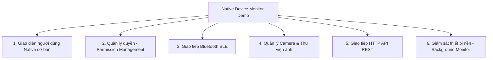
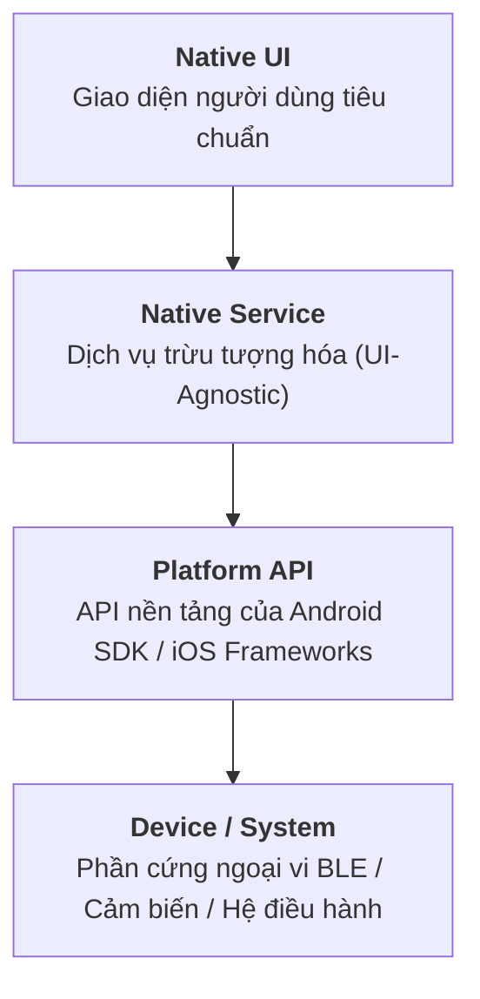
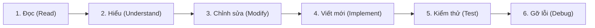
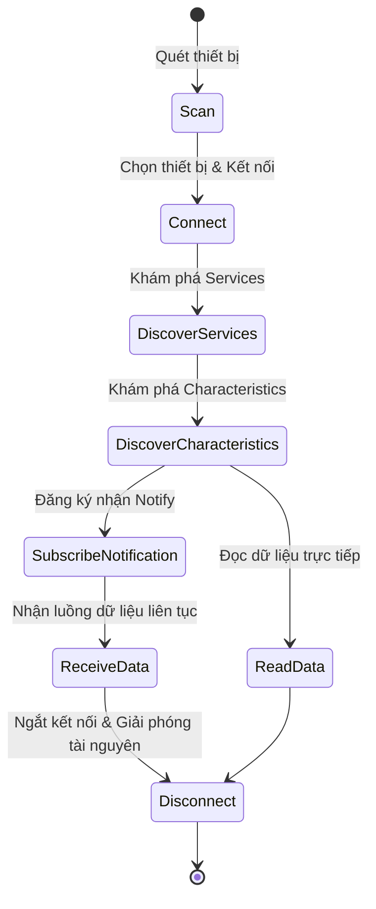

# Mục tiêu & Phạm vi học tập

## 1. Thông tin chương trình
- **Dự án**: Native Mobile Development Learning Plan (Kotlin + Swift)
- **Đội ngũ**: CarMDConnect
- **Ngôn ngữ chủ đạo**:
  - Android **Kotlin** (Java chỉ dùng để đọc và hiểu mã nguồn cũ nếu có)
  - iOS **Swift**

::: danger QUY TẮC CỐT LÕI (IMPORTANT)
**Tuyệt đối KHÔNG viết mã nguồn demo bằng AI**. Tất cả các phần phải được viết bằng tay. Toàn bộ mục tiêu của kế hoạch này là để lập trình viên tự tay trải nghiệm và thấu hiểu thực tế lập trình Native. Việc để AI sinh mã nguồn sẽ làm mất đi hoàn toàn giá trị của chương trình.

AI và tài liệu tra cứu chỉ được dùng để tìm hiểu khái niệm, cú pháp và thông số API.
:::

---

## 2. Mục tiêu đào tạo (Goal)
Xây dựng năng lực thực chiến trong lập trình Native Mobile nhằm:
1. **Đọc hiểu mã nguồn Native hiện có** trên cả Android và iOS.
2. **Nắm vững vòng đời ứng dụng Native** (Application & Component Lifecycle: onCreate, onResume, viewDidLoad, viewWillAppear,...).
3. **Chỉnh sửa và nâng cấp mã nguồn Native** một cách tự tin và chuẩn mực.
4. **Tương tác với các API phần cứng** (Camera, Bluetooth BLE, Pin, Mạng, Bộ nhớ cục bộ).
5. **Thiết kế và xây dựng các Native Services / Classes tái sử dụng**.
6. **Xử lý các tác vụ bất đồng bộ (Asynchronous Native APIs)** và cập nhật UI đúng thread.
7. **Làm chủ Bluetooth Low Energy (BLE)** từ quét, kết nối, khám phá thuộc tính, đọc/ghi và nhận thông báo (Notification).
8. **Thấu hiểu cơ chế chạy nền (Background Execution)** và các ràng buộc nghiêm ngặt của hệ điều hành.
9. **Hoàn thiện một ứng dụng Native hoàn chỉnh** trên cả Android và iOS.

---

## 3. Dự án đầu ra: Native Device Monitor Demo

Dự án mẫu mang tên **Native Device Monitor Demo**, một ứng dụng native nhỏ trên cả Android và iOS tích hợp 6 năng lực cốt lõi:

Ứng dụng bắt buộc áp dụng nguyên lý tách tầng: **UI không chứa logic phần cứng**, mọi thao tác thiết bị đều thông qua các Service dùng lại được.

---

## 4. Phạm vi học tập (Learning Scope)

Chương trình tập trung vào chuỗi liên kết xuyên suốt sau:

Lập trình viên cần hiểu rõ cách:
- Gọi các native API của hệ điều hành.
- Xử lý các tác vụ bất đồng bộ (Coroutines trên Android / async-await trên iOS).
- Quản lý và xử lý phản hồi xin cấp quyền từ người dùng.
- Lắng nghe và điều hướng theo sự thay đổi vòng đời ứng dụng.
- Xử lý sự kiện (callbacks/events) và lỗi (error handling).
- Tách biệt UI khỏi logic thiết bị.

---

## 5. Những phần NẰM NGOÀI PHẠM VI (Out of Scope)

Để đảm bảo tập trung tối đa vào kỹ năng Native cốt lõi trong thời lượng cam kết, **KHÔNG** tốn thời gian cho các nội dung sau:

- Triển khai Capacitor plugin hoặc tích hợp Ionic/Angular.
- Ngôn ngữ nâng cao: Advanced Kotlin hoặc Advanced Swift.
- Phát triển ứng dụng hoàn chỉnh bằng Java.
- Thiết kế UI/UX nâng cao, hệ thống Design System hoặc animation phức tạp.
- Khung kiến trúc phức tạp (MVI/Clean Architecture nhiều lớp, Navigation graph phức tạp).
- Framework Dependency Injection (Dagger, Hilt, Koin, Swinject).
- Framework viết Unit Test / Automated Test.
- Quy trình CI/CD, đóng gói phát hành App Store hoặc Google Play Store.
- Hệ thống xác thực người dùng (Authentication), Token Refresh, Caching phức tạp.
- Cơ sở dữ liệu quan hệ phức tạp (Room, CoreData), Cloud backend.
- Giao thức BLE phức tạp, OTA firmware update, Bluetooth Classic.
- Xử lý ảnh nâng cao (compression pipeline, video editing).

---

## 6. Kết quả đầu ra (Final Outcome)

Sau khi hoàn thành chương trình, lập trình viên đạt được năng lực toàn diện:

Lập trình viên nắm vững kiến trúc phân tầng chuẩn và luồng BLE 9 bước hoàn chỉnh:

