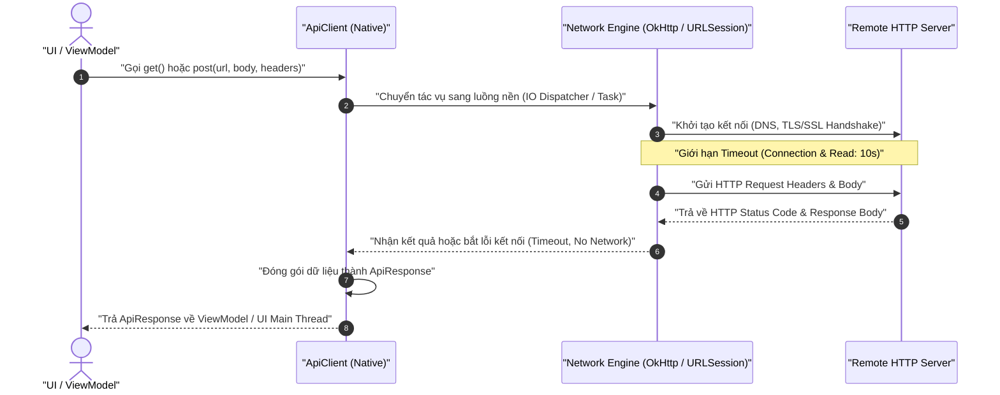

# 5. HTTP API Client

Module này hướng dẫn xây dựng một HTTP Client native tái sử dụng (**ApiClient**), có khả năng thực thi các yêu cầu HTTP cơ bản (GET, POST), gắn Header, gửi/nhận JSON, xử lý mã phản hồi (HTTP Status Codes), bắt lỗi mạng và ngắt khi quá thời gian chờ (Timeout).

---

## 1. Yêu cầu & Khái niệm nền tảng

### 1. Yêu cầu tính năng
1. **Gửi yêu cầu GET**: Truy vấn dữ liệu từ API URL, hỗ trợ query parameters.
2. **Gửi yêu cầu POST**: Gửi dữ liệu kèm payload JSON ở phần thân (Request Body).
3. **Quản lý Headers**: Đính kèm các trường tiêu chuẩn như [`Content-Type`](https://developer.mozilla.org/en-US/docs/Web/HTTP/Headers/Content-Type): `application/json`, [`Accept`](https://developer.mozilla.org/en-US/docs/Web/HTTP/Headers/Accept): `application/json`.
4. **Xử lý phản hồi**:
   - HTTP Status thành công (200..299).
   - HTTP Status lỗi máy chủ hoặc client (400, 401, 403, 404, 500).
5. **Xử lý lỗi mạng**: Mất kết nối internet, sai hostname, DNS resolution fail.
6. **Xử lý Timeout**: Thiết lập thời gian chờ kết nối (Connection Timeout: 10s) và thời gian đọc dữ liệu (Read Timeout: 10s).
7. **Bất đồng bộ**: Thực thi ở background thread, không bao giờ chặn (block) UI thread.

::: warning GIỚI HẠN PHẠM VI
Không triển khai:
- Cơ chế làm mới token tự động (Token Refresh / OAuth2 flow).
- Caching tầng mạng phức tạp.
- Phân trang (Pagination) phức tạp.
:::

### 2. Khái niệm nền tảng: Bất đồng bộ & An toàn mạng
- **Nguyên tắc Main Thread**: Cả Android và iOS nghiêm cấm thực thi tác vụ mạng đồng bộ trên luồng chính. Android sẽ ngay lập tức ném ra ngoại lệ [`NetworkOnMainThreadException`](https://developer.android.com/reference/android/os/NetworkOnMainThreadException), còn iOS sẽ gây đơ giật UI và có thể bị Watchdog tiêu diệt tiến trình. Do đó, mã nguồn bắt buộc dùng Kotlin Coroutines ([`Dispatchers.IO`](https://kotlinlang.org/api/kotlinx.coroutines/kotlinx-coroutines-core/kotlinx.coroutines/-dispatchers/-i-o.html)) hoặc Swift Concurrency ([`async/await`](https://developer.apple.com/documentation/swift/task)).
- **Chính sách kết nối an toàn (HTTPS mặc định)**:
  - Android 9 (API 28+) mặc định vô hiệu hóa lưu lượng bản rõ (cleartext HTTP). Nếu cần kết nối `http://` cục bộ, phải bật cờ [`android:usesCleartextTraffic="true"`](https://developer.android.com/guide/topics/manifest/application-element#usesCleartextTraffic) hoặc dùng Network Security Config.
  - iOS áp dụng chuẩn **App Transport Security (ATS)** khắt khe từ iOS 9. Mọi kết nối bắt buộc qua HTTPS với TLS 1.2+ trừ khi khai báo ngoại lệ [`NSAppTransportSecurity`](https://developer.apple.com/documentation/bundleresources/information_property_list/nsapptransportsecurity) trong [`Info.plist`](https://developer.apple.com/documentation/bundleresources/information_property_list).

---

## 2. Kiến trúc & Luồng xử lý (Request Lifecycle)



---

## 3. Đặc tả Public Interface (Kotlin & Swift)

::: code-group
```kotlin [Kotlin (Android - ApiClient.kt)]
data class ApiResponse(
    val statusCode: Int,
    val body: String?,
    val isSuccessful: Boolean,
    val errorMessage: String? = null
)

interface ApiClient {
    suspend fun get(url: String, headers: Map<String, String>? = null): ApiResponse
    suspend fun post(url: String, jsonBody: String, headers: Map<String, String>? = null): ApiResponse
}
```

```swift [Swift (iOS - ApiClient.swift)]
struct ApiResponse {
    let statusCode: Int
    let body: String?
    let isSuccessful: Bool
    let errorMessage: String?
}

protocol ApiClientProtocol {
    func get(url: String, headers: [String: String]?) async -> ApiResponse
    func post(url: String, jsonBody: String, headers: [String: String]?) async -> ApiResponse
}
```
:::

---

## 4. So sánh mã nguồn thực thi Native

### 1. Thực thi GET Request (Async/Await)

::: code-group
```kotlin [Kotlin (Android - OkHttp + Coroutines)]
val client = OkHttpClient.Builder()
    .connectTimeout(10, TimeUnit.SECONDS)
    .readTimeout(10, TimeUnit.SECONDS)
    .build()

val request = Request.Builder()
    .url("https://jsonplaceholder.typicode.com/posts/1")
    .addHeader("Accept", "application/json")
    .get()
    .build()

withContext(Dispatchers.IO) {
    client.newCall(request).execute().use { response ->
        val statusCode = response.code
        val bodyString = response.body?.string()
        println("Status: $statusCode, Body: $bodyString")
    }
}
```

```swift [Swift (iOS - URLSession + async/await)]
guard let url = URL(string: "https://jsonplaceholder.typicode.com/posts/1") else { return }

var request = URLRequest(url: url)
request.httpMethod = "GET"
request.timeoutInterval = 10.0
request.setValue("application/json", forHTTPHeaderField: "Accept")

do {
    let (data, response) = try await URLSession.shared.data(for: request)
    if let httpResponse = response as? HTTPURLResponse {
        let bodyString = String(data: data, encoding: .utf8)
        print("Status: \(httpResponse.statusCode), Body: \(bodyString ?? "")")
    }
} catch {
    print("Network error: \(error.localizedDescription)")
}
```
:::

### 2. Thực thi POST Request kèm JSON Body

::: code-group
```kotlin [Kotlin (Android - OkHttp POST)]
val jsonMediaType = "application/json; charset=utf-8".toMediaType()
val jsonPayload = """{"title": "Native Dev", "body": "Learning Plan"}"""
val requestBody = jsonPayload.toRequestBody(jsonMediaType)

val request = Request.Builder()
    .url("https://jsonplaceholder.typicode.com/posts")
    .addHeader("Content-Type", "application/json")
    .post(requestBody)
    .build()

withContext(Dispatchers.IO) {
    client.newCall(request).execute().use { response ->
        val statusCode = response.code
        val responseBody = response.body?.string()
        println("POST Status: $statusCode, Result: $responseBody")
    }
}
```

```swift [Swift (iOS - URLSession POST)]
guard let url = URL(string: "https://jsonplaceholder.typicode.com/posts") else { return }

var request = URLRequest(url: url)
request.httpMethod = "POST"
request.timeoutInterval = 10.0
request.setValue("application/json", forHTTPHeaderField: "Content-Type")

let jsonPayload = """{"title": "Native Dev", "body": "Learning Plan"}"""
request.httpBody = jsonPayload.data(using: .utf8)

do {
    let (data, response) = try await URLSession.shared.data(for: request)
    if let httpResponse = response as? HTTPURLResponse {
        let responseBody = String(data: data, encoding: .utf8)
        print("POST Status: \(httpResponse.statusCode), Result: \(responseBody ?? "")")
    }
} catch {
    print("Network error: \(error.localizedDescription)")
}
```
:::

---

## 5. Tài liệu tra cứu tham chiếu (Ref Docs)

### <span class="badge-android">Android Reference Documentation</span>

#### 1. Quyền Internet trong AndroidManifest.xml
Bắt buộc khai báo quyền Internet:

```xml
<uses-permission android:name="android.permission.INTERNET" />
<uses-permission android:name="android.permission.ACCESS_NETWORK_STATE" />
```

- [`android.permission.INTERNET`](https://developer.android.com/reference/android/Manifest.permission#INTERNET): Cấp phép mở socket kết nối ra Internet.
- [`android.permission.ACCESS_NETWORK_STATE`](https://developer.android.com/reference/android/Manifest.permission#ACCESS_NETWORK_STATE): Kiểm tra trạng thái mạng trước khi gửi request.
- *Lưu ý: Nếu kiểm thử với endpoint `http://` (không phải `https://`), cần thêm cờ [`android:usesCleartextTraffic="true"`](https://developer.android.com/guide/topics/manifest/application-element#usesCleartextTraffic) trong thẻ [`<application>`](https://developer.android.com/guide/topics/manifest/application-element).*

#### 2. Thao tác Mạng với HttpURLConnection & OkHttp
- [Connect to the Network Guide](https://developer.android.com/training/basics/network-ops/connecting): Sử dụng [`HttpURLConnection`](https://developer.android.com/reference/java/net/HttpURLConnection) có sẵn trong Android SDK.
- [OkHttp Official Documentation](https://square.github.io/okhttp/): Thư viện HTTP Client chuẩn công nghiệp cho Android.

---

### <span class="badge-ios">iOS Reference Documentation</span>

#### 1. URLSession & Swift Concurrency
- [Apple URLSession Documentation](https://developer.apple.com/documentation/foundation/urlsession): Framework mạng native mạnh mẽ của iOS ([`URLSession`](https://developer.apple.com/documentation/foundation/urlsession)).
- [URLRequest API](https://developer.apple.com/documentation/foundation/urlrequest): Cấu hình URL, HTTP Method, HTTP Body và Headers ([`URLRequest`](https://developer.apple.com/documentation/foundation/urlrequest)).
- [App Transport Security (ATS)](https://developer.apple.com/documentation/security/preventing_insecure_network_connections): Cấu hình [`NSAppTransportSecurity`](https://developer.apple.com/documentation/bundleresources/information_property_list/nsapptransportsecurity) trong [`Info.plist`](https://developer.apple.com/documentation/bundleresources/information_property_list) khi cần gọi API `http://` nội bộ.
