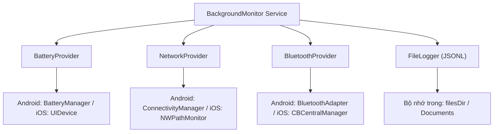

# 6. Background Device Monitor & File Logger

Module này hướng dẫn xây dựng dịch vụ giám sát trạng thái thiết bị theo chu kỳ (**BackgroundMonitor**), ghi nhật ký định dạng JSONL vào bộ nhớ cục bộ (**FileLogger**), và nghiên cứu hành vi thực tế của hệ điều hành qua 5 trạng thái ứng dụng.

---

## 1. Yêu cầu & Khái niệm nền tảng

### 1. Dữ liệu thu thập & Định dạng JSONL
Cứ sau một khoảng thời gian (chu kỳ `interval` tính bằng giây), hệ thống thu thập:
1. **Phần trăm pin (Battery Level)**: Giá trị từ 0 đến 100%.
2. **Trạng thái Wi-Fi**: Bật/tắt và đã kết nối hay chưa.
3. **Trạng thái Mạng di động (Cellular)**: Có sẵn hay không.
4. **Trạng thái Bluetooth**: Bật/tắt và có đang kết nối thiết bị nào không.
5. **Dấu thời gian (Timestamp)**: Chuỗi ISO-8601 chuẩn.

#### Định dạng lưu trữ JSONL (JSON Lines)
Mỗi bản ghi được lưu thành một dòng JSON riêng biệt, kết thúc bằng ký tự xuống dòng `\n`. Cơ chế này tối ưu cho thiết bị di động: không cần đọc và phân tích (parse) toàn bộ file vào RAM khi cần ghi thêm (append).

```json
{"timestamp":"2026-09-15T10:30:00Z","battery":82,"wifiConnected":true,"cellularAvailable":true,"bluetoothEnabled":true,"bluetoothConnected":false}
{"timestamp":"2026-09-15T10:30:10Z","battery":82,"wifiConnected":true,"cellularAvailable":true,"bluetoothEnabled":true,"bluetoothConnected":false}
{"timestamp":"2026-09-15T10:30:20Z","battery":81,"wifiConnected":false,"cellularAvailable":true,"bluetoothEnabled":true,"bluetoothConnected":false}
```

### 2. Khái niệm nền tảng: Cơ chế tiết kiệm năng lượng của OS
- **Android**: Giới thiệu Doze Mode và App Standby từ Android 6.0+. Khi màn hình tắt và máy không cắm sạc, hệ thống hạn chế truy cập mạng và hoãn các tác vụ nền. Muốn ứng dụng tiếp tục chạy định kỳ khi rời màn hình chính, Android yêu cầu sử dụng **Foreground Service** hiển thị thông báo liên tục (ongoing notification) cho người dùng.
- **iOS**: Apple áp dụng chiến lược tối ưu pin nghiêm ngặt nhất. Khi ứng dụng chuyển sang Background, hệ thống chỉ cho phép thực thi tối đa ~30 giây trước khi đưa app vào trạng thái Suspended. Để chạy tác vụ nền, nhà phát triển phải đăng ký thông qua [`BGTaskScheduler`](https://developer.apple.com/documentation/backgroundtasks/bgtaskscheduler), và thời điểm kích hoạt hoàn toàn do hệ điều hành quyết định dựa trên thói quen người dùng và mức pin.

---

## 2. Kiến trúc & Ma trận hành vi 5 trạng thái

### 1. Kiến trúc Provider & Logger



### 2. Nghiên cứu thực tế: Ma trận hành vi 5 trạng thái (Behavior Matrix)

::: tip MỤC TIÊU HỌC TẬP QUAN TRỌNG
**Thấu hiểu hành vi thực tế của nền tảng, không cố gắng "lách" (bypass) cơ chế bảo vệ của hệ điều hành.** Ghi chép tài liệu và code comment chi tiết cách mỗi OS ứng xử.
:::

| Trạng thái ứng dụng | <span class="badge-android">Android</span> Hành vi & Cơ chế | <span class="badge-ios">iOS</span> Hành vi & Cơ chế |
| :--- | :--- | :--- |
| **1. Foreground (Đang mở)** | Timer/Coroutine chạy chính xác theo chu kỳ (ví dụ: mỗi 5s hoặc 10s). | [`Timer`](https://developer.apple.com/documentation/foundation/timer) hoặc [`Task.sleep`](https://developer.apple.com/documentation/swift/task/sleep(nanoseconds:)) chạy chính xác theo chu kỳ. |
| **2. Background (Thu nhỏ)** | Nếu không có **Foreground Service**, hệ thống sẽ Doze mode hoặc giảm tần suất.<br>Nếu có Foreground Service (hiện Notification), timer vẫn chạy đều. | ⚠️ **iOS ngắt Timer sau ~30 giây** khi vào background. [`BGAppRefreshTask`](https://developer.apple.com/documentation/backgroundtasks/bgapprefreshtask) không đảm bảo chu kỳ cố định (OS tự quyết định thời điểm chạy). |
| **3. Return to Foreground** | Trở lại bình thường, tiếp tục ghi log. | Ứng dụng tiếp tục chạy [`Timer`](https://developer.apple.com/documentation/foundation/timer) từ thời điểm mở lại. |
| **4. OS Termination (Hệ thống giải phóng)** | Bị dừng khi thiếu RAM. Khi người dùng mở lại, Activity được tái tạo. | Bị dừng khi thiếu RAM. Mở lại sẽ khởi động từ đầu. |
| **5. Force-kill (Vuốt tắt đa nhiệm)** | Mọi tiến trình bị tiêu diệt ngay lập tức. Cần người dùng mở lại thủ công. | Bị tiêu diệt hoàn toàn. Không một background task nào được chạy tiếp cho đến khi người dùng tự tay mở lại. |

---

## 3. Đặc tả Public Interface (Kotlin & Swift)

::: code-group
```kotlin [Kotlin (Android - BackgroundMonitor.kt)]
data class DeviceSnapshot(
    val timestamp: String,
    val battery: Int,
    val wifiConnected: Boolean,
    val cellularAvailable: Boolean,
    val bluetoothEnabled: Boolean,
    val bluetoothConnected: Boolean
)

interface BackgroundMonitor {
    fun startMonitoring(intervalSeconds: Long)
    fun stopMonitoring()
    fun getLatestSnapshot(): DeviceSnapshot
    fun readLogEntries(): List<DeviceSnapshot>
}
```

```swift [Swift (iOS - BackgroundMonitor.swift)]
struct DeviceSnapshot {
    let timestamp: String
    let battery: Int
    let wifiConnected: Bool
    let cellularAvailable: Bool
    let bluetoothEnabled: Bool
    let bluetoothConnected: Bool
}

protocol BackgroundMonitorProtocol {
    func startMonitoring(intervalSeconds: TimeInterval)
    func stopMonitoring()
    func getLatestSnapshot() -> DeviceSnapshot
    func readLogEntries() -> [DeviceSnapshot]
}
```
:::

---

## 4. So sánh mã nguồn thực thi Native

### 1. Đọc dung lượng Pin (Battery Level)

::: code-group
```kotlin [Kotlin (Android - IntentFilter)]
val filter = IntentFilter(Intent.ACTION_BATTERY_CHANGED)
val batteryStatus = context.registerReceiver(null, filter)
val level = batteryStatus?.getIntExtra(BatteryManager.EXTRA_LEVEL, -1) ?: -1
val scale = batteryStatus?.getIntExtra(BatteryManager.EXTRA_SCALE, -1) ?: -1
val batteryPct = if (level >= 0 && scale > 0) (level * 100 / scale.toFloat()).toInt() else 0
```

```swift [Swift (iOS - UIDevice)]
UIDevice.current.isBatteryMonitoringEnabled = true
let rawLevel = UIDevice.current.batteryLevel // Giá trị từ 0.0 đến 1.0 (-1.0 nếu simulator)
let batteryPct = rawLevel >= 0 ? Int(rawLevel * 100) : 100
```
:::

### 2. Theo dõi trạng thái Mạng (Wi-Fi & Cellular)

::: code-group
```kotlin [Kotlin (Android - ConnectivityManager)]
val cm = context.getSystemService(Context.CONNECTIVITY_SERVICE) as ConnectivityManager
val activeNetwork = cm.activeNetwork
val caps = cm.getNetworkCapabilities(activeNetwork)

val isConnected = caps != null && caps.hasCapability(NetworkCapabilities.NET_CAPABILITY_INTERNET)
val isWifi = caps?.hasTransport(NetworkCapabilities.TRANSPORT_WIFI) == true
val isCellular = caps?.hasTransport(NetworkCapabilities.TRANSPORT_CELLULAR) == true
```

```swift [Swift (iOS - Network NWPathMonitor)]
let monitor = NWPathMonitor()
monitor.pathUpdateHandler = { path in
    let isConnected = (path.status == .satisfied)
    let isWifi = path.usesInterfaceType(.wifi)
    let isCellular = path.usesInterfaceType(.cellular)
    print("Mạng: connected=\(isConnected), wifi=\(isWifi), cellular=\(isCellular)")
}
let queue = DispatchQueue(label: "NetworkMonitor")
monitor.start(queue: queue)
```
:::

### 3. Ghi dữ liệu nối tiếp vào file JSONL (FileLogger)

::: code-group
```kotlin [Kotlin (Android - FileLogger)]
class FileLogger(private val context: Context, private val fileName: String = "device_metrics.jsonl") {
    private val logFile = File(context.filesDir, fileName)

    fun appendEntry(jsonString: String) {
        // Ghi nối tiếp (append) một dòng mới kèm ký tự xuống dòng
        logFile.appendText("$jsonString\n", Charsets.UTF_8)
    }

    fun readAllEntries(): List<String> {
        if (!logFile.exists()) return emptyList()
        return logFile.readLines(Charsets.UTF_8)
    }
}
```

```swift [Swift (iOS - FileLogger)]
final class FileLogger {
    private let fileURL: URL

    init(fileName: String = "device_metrics.jsonl") {
        let docs = FileManager.default.urls(for: .documentDirectory, in: .userDomainMask)[0]
        self.fileURL = docs.appendingPathComponent(fileName)
    }

    func appendEntry(_ jsonString: String) {
        guard let data = "\(jsonString)\n".data(using: .utf8) else { return }
        if FileManager.default.fileExists(atPath: fileURL.path) {
            if let handle = try? FileHandle(forWritingTo: fileURL) {
                handle.seekToEndOfFile()
                handle.write(data)
                handle.closeFile()
            }
        } else {
            try? data.write(to: fileURL, options: .atomic)
        }
    }

    func readAllEntries() -> [String] {
        guard let content = try? String(contentsOf: fileURL, encoding: .utf8) else { return [] }
        return content.components(separatedBy: .newlines).filter { !$0.isEmpty }
    }
}
```
:::

---

## 5. Tài liệu tra cứu tham chiếu (Ref Docs)

### <span class="badge-android">Android Reference Documentation</span>

#### 1. Đọc trạng thái Pin & Kết nối Mạng
- [Monitor the Battery Level and Charging State](https://developer.android.com/topic/performance/power/battery-monitoring): Đăng ký nhận [`Intent.ACTION_BATTERY_CHANGED`](https://developer.android.com/reference/android/content/Intent#ACTION_BATTERY_CHANGED) và [`BatteryManager`](https://developer.android.com/reference/android/os/BatteryManager) để lấy pin tức thời.
- [Monitor Network Connectivity](https://developer.android.com/training/monitoring-device-state/connectivity-status-type): Sử dụng [`ConnectivityManager`](https://developer.android.com/reference/android/net/ConnectivityManager) và [`NetworkCapabilities`](https://developer.android.com/reference/android/net/NetworkCapabilities) để phân biệt Wi-Fi / 4G-5G.

#### 2. Xử lý nền: Foreground Service & WorkManager
- [Foreground Services Guide](https://developer.android.com/develop/background-work/services/foreground-services): Tạo Service kèm Notification bền vững để chạy định kỳ.
- [WorkManager Guide](https://developer.android.com/topic/libraries/architecture/workmanager): Chuẩn của Google cho các tác vụ nền định kỳ ([`WorkManager`](https://developer.android.com/reference/androidx/work/WorkManager) / [`PeriodicWorkRequest`](https://developer.android.com/reference/androidx/work/PeriodicWorkRequest) với khoảng thời gian tối thiểu là 15 phút).

---

### <span class="badge-ios">iOS Reference Documentation</span>

#### 1. Đọc thông số Pin & NWPathMonitor
- [UIDevice Battery Monitoring](https://developer.apple.com/documentation/uikit/uidevice): Bắt buộc bật [`isBatteryMonitoringEnabled`](https://developer.apple.com/documentation/uikit/uidevice/1620051-isbatterymonitoringenabled) trên [`UIDevice`](https://developer.apple.com/documentation/uikit/uidevice) trước khi đọc [`batteryLevel`](https://developer.apple.com/documentation/uikit/uidevice/1620042-batterylevel).
- [NWPathMonitor Official Documentation](https://developer.apple.com/documentation/network/nwpathmonitor): Theo dõi kết nối mạng Wi-Fi và Mạng di động một cách hiện đại với [`NWPathMonitor`](https://developer.apple.com/documentation/network/nwpathmonitor), tiêu tốn ít pin.

#### 2. BackgroundTasks Framework trên iOS
- [Apple BackgroundTasks Documentation](https://developer.apple.com/documentation/backgroundtasks): Hướng dẫn sử dụng [`BGTaskScheduler`](https://developer.apple.com/documentation/backgroundtasks/bgtaskscheduler) và [`BGAppRefreshTask`](https://developer.apple.com/documentation/backgroundtasks/bgapprefreshtask).
- **Ràng buộc của Apple**: Hệ điều hành iOS tối ưu hóa pin triệt để. Apple *không cung cấp cơ chế chạy định kỳ mỗi X giây ở background* cho các ứng dụng thông thường (ngoại trừ app định vị Navigation liên tục hoặc phát nhạc Audio). Việc ghi nhận hạn chế này là một phần trọng tâm của tài liệu.
