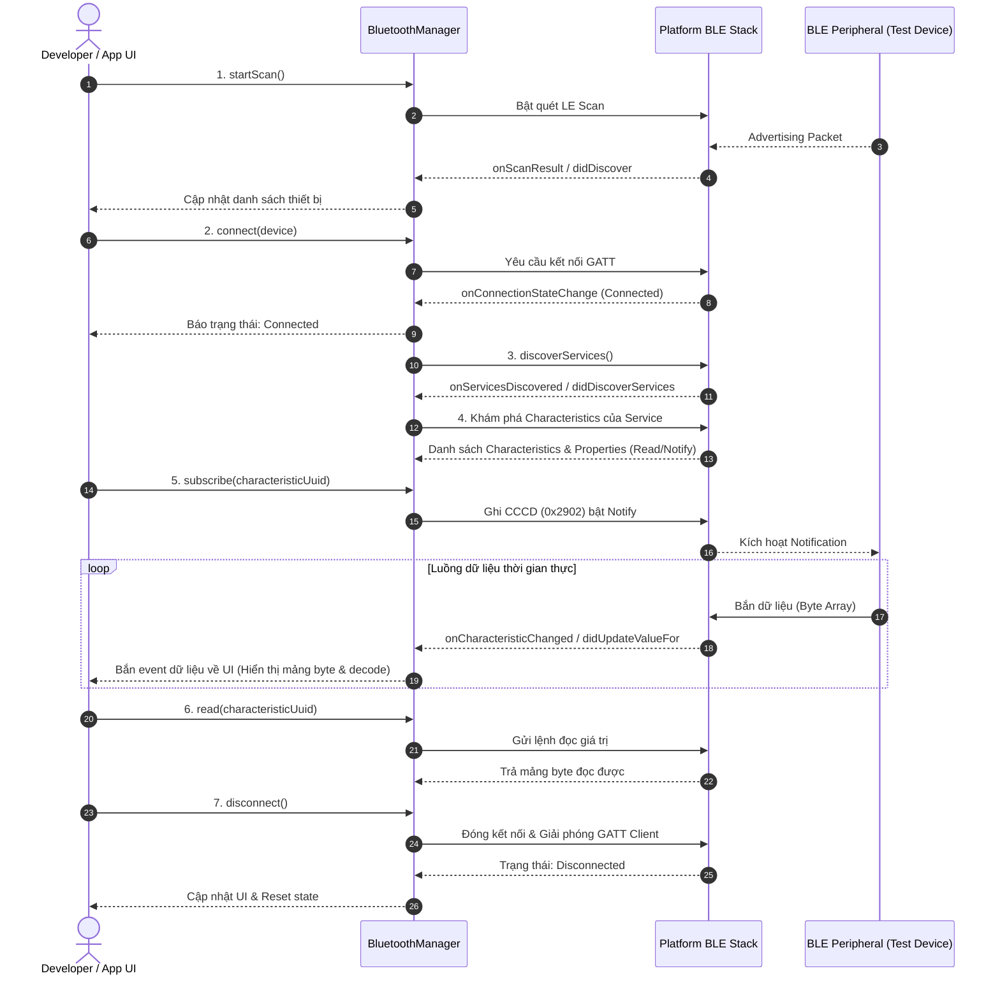

# 3. Bluetooth BLE Manager

Bluetooth Low Energy (BLE) là **khối kiến thức lớn và quan trọng nhất** trong toàn bộ chương trình đào tạo. Mục tiêu là làm chủ trọn vẹn vòng đời kết nối và luồng truyền nhận dữ liệu GATT.

---

## 1. Yêu cầu & Khái niệm nền tảng

- **Central vs Peripheral**:
  - **Peripheral (Ngoại vi)**: Thiết bị phát quảng bá (Broadcast/Advertise) và cung cấp dữ liệu (ví dụ: cảm biến ESP32, nRF Connect simulator, vòng đeo tay, máy quét OBD).
  - **Central (Trung tâm)**: Điện thoại Android / iOS, quét tìm thiết bị, khởi tạo kết nối và đọc/nhận dữ liệu.
- **Cấu trúc dữ liệu GATT (Generic Attribute Profile)**:
  - **Profile**: Nhóm các Services.
  - **Service**: Tập hợp logic các dữ liệu (xác định bằng UUID, ví dụ: [Heart Rate Service `0x180D`](https://www.bluetooth.com/specifications/specs/heart-rate-service-1-0/)).
  - **Characteristic**: Điểm dữ liệu cụ thể chứa mảng byte ([ByteArray](https://kotlinlang.org/api/latest/jvm/stdlib/kotlin/-byte-array/) / [Data](https://developer.apple.com/documentation/foundation/data)) và các quyền truy cập: [`Read`](https://developer.apple.com/documentation/corebluetooth/cbcharacteristicproperties/1518712-read), [`Write`](https://developer.apple.com/documentation/corebluetooth/cbcharacteristicproperties/1518797-write), [`Notify`](https://developer.apple.com/documentation/corebluetooth/cbcharacteristicproperties/1518784-notify), [`Indicate`](https://developer.apple.com/documentation/corebluetooth/cbcharacteristicproperties/1519011-indicate).
  - **Descriptor**: Metadata bổ sung (đặc biệt là Client Characteristic Configuration Descriptor - **CCCD** [`0x2902`](https://developer.android.com/reference/android/bluetooth/BluetoothGattDescriptor#ENABLE_NOTIFICATION_VALUE) dùng để kích hoạt Notify).

---

## 2. Kiến trúc & Luồng xử lý (9 Bước BLE)



---

## 3. Đặc tả Public Interface (Kotlin & Swift)

::: code-group
```kotlin [Kotlin (Android - BluetoothManager.kt)]
interface BluetoothManager {
    fun isAvailable(): Boolean
    fun isEnabled(): Boolean
    fun startScan(onDeviceFound: (BleDevice) -> Unit, onError: (String) -> Unit)
    fun stopScan()
    fun connect(deviceAddress: String, onStateChange: (ConnectionState) -> Unit)
    fun disconnect()
    fun discoverServices(onSuccess: (List<BleService>) -> Unit, onError: (String) -> Unit)
    fun read(characteristicUuid: String, onResult: (ByteArray?, String?) -> Unit)
    fun subscribe(characteristicUuid: String, onNotification: (ByteArray) -> Unit)
    fun unsubscribe(characteristicUuid: String)
    fun getConnectionState(): ConnectionState
}
```

```swift [Swift (iOS - BluetoothManager.swift)]
protocol BluetoothManagerProtocol {
    func isAvailable() -> Bool
    func isEnabled() -> Bool
    func startScan(onDeviceFound: @escaping (BleDevice) -> Void, onError: @escaping (String) -> Void)
    func stopScan()
    func connect(peripheralId: UUID, onStateChange: @escaping (ConnectionState) -> Void)
    func disconnect()
    func discoverServices(onSuccess: @escaping ([BleService]) -> Void, onError: @escaping (String) -> Void)
    func read(characteristicUuid: CBUUID, completion: @escaping (Data?, Error?) -> Void)
    func subscribe(characteristicUuid: CBUUID, onNotification: @escaping (Data) -> Void)
    func unsubscribe(characteristicUuid: CBUUID)
    func getConnectionState() -> ConnectionState
}
```
:::

---

## 4. So sánh mã nguồn thực thi Native

### 1. Xử lý ngắt kết nối đột ngột (Unexpected Disconnection)

Một bài test bắt buộc trong chương trình là: **Tắt nguồn thiết bị Peripheral khi đang truyền dữ liệu**.
- Ứng dụng phải tự động phát hiện sự kiện mất kết nối thông qua callback của hệ điều hành.
- Cập nhật ngay lập tức trạng thái giao diện sang [`Disconnected`](https://developer.android.com/reference/android/bluetooth/BluetoothProfile#STATE_DISCONNECTED).
- Dọn dẹp tài nguyên (hủy đăng ký listener, đóng GATT client).
- Không được xảy ra hiện tượng văng ứng dụng (crash) hay rò rỉ bộ nhớ.

### 2. Kích hoạt Notify qua CCCD (Android vs iOS)

::: code-group
```kotlin [Kotlin (Android - Ghi CCCD Descriptor)]
// Trên Android, ta phải tìm Descriptor 0x2902 và ghi ENABLE_NOTIFICATION_VALUE
val cccdUuid = UUID.fromString("00002902-0000-1000-8000-00805f9b34fb")
val descriptor = characteristic.getDescriptor(cccdUuid)
if (descriptor != null) {
    gatt.setCharacteristicNotification(characteristic, true)
    descriptor.value = BluetoothGattDescriptor.ENABLE_NOTIFICATION_VALUE
    gatt.writeDescriptor(descriptor)
}
```

```swift [Swift (iOS - setNotifyValue)]
// Trên iOS CoreBluetooth, hệ điều hành tự động bắt tay CCCD ngầm
peripheral.setNotifyValue(true, for: characteristic)
```
:::

- Android yêu cầu ghi trực tiếp qua [`BluetoothGattDescriptor.ENABLE_NOTIFICATION_VALUE`](https://developer.android.com/reference/android/bluetooth/BluetoothGattDescriptor#ENABLE_NOTIFICATION_VALUE).
- iOS hỗ trợ trực tiếp hàm [`peripheral.setNotifyValue(_:for:)`](https://developer.apple.com/documentation/corebluetooth/cbperipheral/1518949-setnotifyvalue) trên [`CBPeripheral`](https://developer.apple.com/documentation/corebluetooth/cbperipheral).

---

## 5. Tài liệu tra cứu tham chiếu (Ref Docs)

### <span class="badge-android">Android Reference Documentation</span>

#### 1. Quét & Kết nối Bluetooth Low Energy
- [Android BLE Official Guide](https://developer.android.com/develop/connectivity/bluetooth/ble): Tổng quan cơ chế BLE trên Android.
- [Find BLE Devices (Scanning)](https://developer.android.com/develop/connectivity/bluetooth/ble/find-ble-devices): Cách dùng [`BluetoothLeScanner`](https://developer.android.com/reference/android/bluetooth/le/BluetoothLeScanner) và [`ScanCallback`](https://developer.android.com/reference/android/bluetooth/le/ScanCallback).
- [Connect to a GATT Server](https://developer.android.com/develop/connectivity/bluetooth/ble/connect-gatt-server): Kết nối thiết bị qua [`BluetoothDevice.connectGatt()`](https://developer.android.com/reference/android/bluetooth/BluetoothDevice#connectGatt(android.content.Context,boolean,android.bluetooth.BluetoothGattCallback)).

#### 2. Thao tác GATT & Đăng ký Notification
- [BluetoothGattCallback API Reference](https://developer.android.com/reference/android/bluetooth/BluetoothGattCallback): Các hàm callback quan trọng:
  - [`onConnectionStateChange(gatt, status, newState)`](https://developer.android.com/reference/android/bluetooth/BluetoothGattCallback#onConnectionStateChange(android.bluetooth.BluetoothGatt,int,int))
  - [`onServicesDiscovered(gatt, status)`](https://developer.android.com/reference/android/bluetooth/BluetoothGattCallback#onServicesDiscovered(android.bluetooth.BluetoothGatt,int))
  - [`onCharacteristicRead(gatt, characteristic, value, status)`](https://developer.android.com/reference/android/bluetooth/BluetoothGattCallback#onCharacteristicRead(android.bluetooth.BluetoothGatt,android.bluetooth.BluetoothGattCharacteristic,int))
  - [`onCharacteristicChanged(gatt, characteristic, value)`](https://developer.android.com/reference/android/bluetooth/BluetoothGattCallback#onCharacteristicChanged(android.bluetooth.BluetoothGatt,android.bluetooth.BluetoothGattCharacteristic))

---

### <span class="badge-ios">iOS Reference Documentation</span>

#### 1. CoreBluetooth Framework
- [Apple CoreBluetooth Overview](https://developer.apple.com/documentation/corebluetooth): Tài liệu tổng thể về chuẩn kết nối Bluetooth trên iOS.
- [CBCentralManager Documentation](https://developer.apple.com/documentation/corebluetooth/cbcentralmanager): Khởi tạo, quét và quản lý thiết bị ngoại vi.
- [CBCentralManagerDelegate](https://developer.apple.com/documentation/corebluetooth/cbcentralmanagerdelegate): Lắng nghe trạng thái Bluetooth ([`centralManagerDidUpdateState(_:)`](https://developer.apple.com/documentation/corebluetooth/cbcentralmanagerdelegate/1518965-centralmanagerdidupdatestate)), tìm thấy thiết bị ([`didDiscover`](https://developer.apple.com/documentation/corebluetooth/cbcentralmanagerdelegate/1518937-centralmanager)), kết nối ([`didConnect`](https://developer.apple.com/documentation/corebluetooth/cbcentralmanagerdelegate/1518963-centralmanager)) và ngắt kết nối ([`didDisconnectPeripheral`](https://developer.apple.com/documentation/corebluetooth/cbcentralmanagerdelegate/1518923-centralmanager)).

#### 2. CBPeripheral & CBPeripheralDelegate
- [CBPeripheral Documentation](https://developer.apple.com/documentation/corebluetooth/cbperipheral): Quản lý thiết bị đã kết nối.
- [CBPeripheralDelegate](https://developer.apple.com/documentation/corebluetooth/cbperipheraldelegate): Các callback xử lý dữ liệu:
  - [`peripheral(_:didDiscoverServices:)`](https://developer.apple.com/documentation/corebluetooth/cbperipheraldelegate/1518766-peripheral): Khám phá danh sách Services.
  - [`peripheral(_:didDiscoverCharacteristicsFor:error:)`](https://developer.apple.com/documentation/corebluetooth/cbperipheraldelegate/1518839-peripheral): Khám phá Characteristics.
  - [`peripheral(_:didUpdateValueFor:error:)`](https://developer.apple.com/documentation/corebluetooth/cbperipheraldelegate/1518708-peripheral): Nhận giá trị mới (cho cả lệnh Read và Notification stream).

---

## 6. Thử nghiệm trực tiếp với Simulator

Bạn có thể chạy thử nghiệm mô phỏng toàn bộ luồng **Scan ➔ Connect ➔ Subscribe Notify ➔ Decode Stream** cùng với chế độ **Background JSONL Logger** ngay trên trình mô phỏng bên dưới:

<DeviceSimulator />
