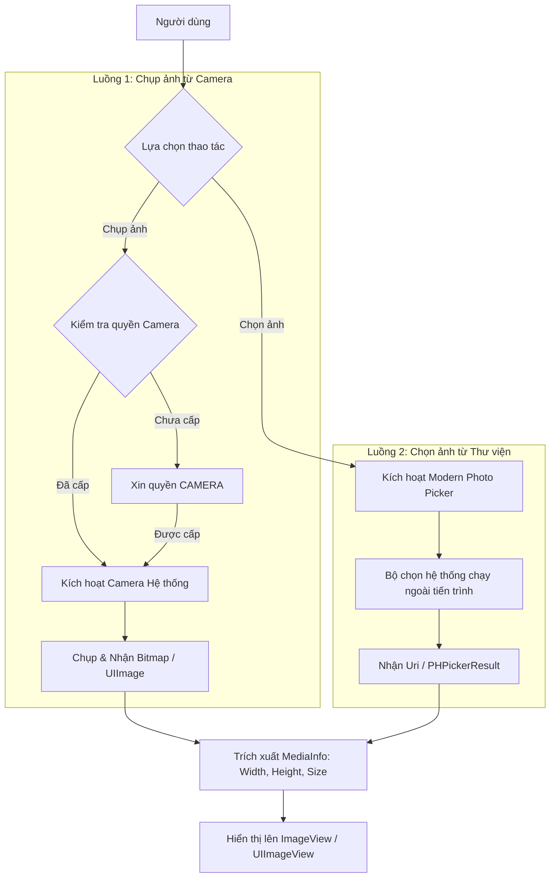

# 4. Camera & Media Manager

Xây dựng dịch vụ quản lý hình ảnh và đa phương tiện (**MediaManager**) với hai tính năng chính: chụp ảnh trực tiếp từ Camera native và chọn ảnh từ Thư viện (Photo Library), sau đó trích xuất thông tin cơ bản và hiển thị lên giao diện.

---

## 1. Yêu cầu & Khái niệm nền tảng

### 1. Yêu cầu tính năng
1. **Yêu cầu quyền Camera**: Kiểm tra và yêu cầu quyền trước khi kích hoạt máy ảnh.
2. **Chụp ảnh (Capture Photo)**: Khởi chạy giao diện camera native, chụp và nhận kết quả ảnh (Bitmap / UIImage).
3. **Chọn ảnh từ thư viện (Pick Media)**: Mở bộ chọn ảnh native hiện đại của hệ điều hành.
4. **Trích xuất thông tin ảnh (Media Info)**: Kích thước (width x height), dung lượng file (bytes), đường dẫn tạm (URI / File path).
5. **Hiển thị ảnh**: Đưa ảnh đã chọn/chụp lên thành phần [`ImageView`](https://developer.android.com/reference/android/widget/ImageView) / [`UIImageView`](https://developer.apple.com/documentation/uikit/uiimageview).

::: warning GIỚI HẠN PHẠM VI (OUT OF SCOPE)
Không triển khai:
- Xử lý ảnh nâng cao (filter, crop phức tạp, nén đa tầng).
- Quay video hoặc chỉnh sửa video.
- Quản lý album ảnh tùy biến.
:::

### 2. Khái niệm nền tảng: Camera vs Modern Photo Picker
- **Camera Native (Cần cấp quyền runtime)**: Kích hoạt phần cứng quang học đòi hỏi quyền nhạy cảm ([`android.permission.CAMERA`](https://developer.android.com/reference/android/Manifest.permission#CAMERA) trên Android và [`NSCameraUsageDescription`](https://developer.apple.com/documentation/bundleresources/information_property_list/nscamerausagedescription) trên iOS).
- **Modern Photo Picker (Không cần xin quyền bộ nhớ)**: Cả Google (Android 13+ qua [`PickVisualMedia`](https://developer.android.com/reference/androidx/activity/result/contract/ActivityResultContracts.PickVisualMedia)) và Apple (iOS 14+ qua [`PHPickerViewController`](https://developer.apple.com/documentation/photokit/phpickerviewcontroller)) đều cung cấp bộ chọn ảnh hệ thống chạy trong tiến trình độc lập. Người dùng chủ động cấp phép cho từng bức ảnh đã chọn, giúp ứng dụng **hoàn toàn không cần quyền đọc toàn bộ kho ảnh/bộ nhớ**.

---

## 2. Kiến trúc & Luồng xử lý



---

## 3. Đặc tả Public Interface (Kotlin & Swift)

::: code-group
```kotlin [Kotlin (Android - MediaManager.kt)]
data class MediaInfo(
    val uri: Uri,
    val width: Int,
    val height: Int,
    val sizeBytes: Long
)

interface MediaManager {
    fun requestCameraPermission(activity: ComponentActivity, onResult: (Boolean) -> Unit)
    fun capturePhoto(onSuccess: (Bitmap) -> Unit, onError: (String) -> Unit)
    fun pickMedia(onSuccess: (Uri) -> Unit, onError: (String) -> Unit)
    fun getMediaInfo(uri: Uri): MediaInfo
}
```

```swift [Swift (iOS - MediaManager.swift)]
struct MediaInfo {
    let image: UIImage
    let width: CGFloat
    let height: CGFloat
    let sizeBytes: Int
}

protocol MediaManagerProtocol {
    func requestCameraPermission(completion: @escaping (Bool) -> Void)
    func capturePhoto(from viewController: UIViewController, completion: @escaping (Result<UIImage, Error>) -> Void)
    func pickMedia(from viewController: UIViewController, completion: @escaping (Result<UIImage, Error>) -> Void)
    func getMediaInfo(image: UIImage) -> MediaInfo
}
```
:::

---

## 4. So sánh mã nguồn thực thi Native

### 1. Modern Photo Picker (Không cần quyền Storage/Library)

Cả Google (Android 13+) và Apple (iOS 14+) đều khuyến nghị dùng Photo Picker hệ thống độc lập để bảo vệ quyền riêng tư người dùng mà không cần xin quyền đọc toàn bộ kho ảnh:

::: code-group
```kotlin [Kotlin (Android - PickVisualMedia)]
val pickMedia = registerForActivityResult(ActivityResultContracts.PickVisualMedia()) { uri ->
    if (uri != null) {
        imageView.setImageURI(uri)
    }
}
// Kích hoạt mở Picker chỉ chọn ảnh
pickMedia.launch(PickVisualMediaRequest(ActivityResultContracts.PickVisualMedia.ImageOnly))
```

```swift [Swift (iOS - PHPickerViewController)]
var config = PHPickerConfiguration()
config.filter = .images
config.selectionLimit = 1

let picker = PHPickerViewController(configuration: config)
picker.delegate = self
present(picker, animated: true)

// PHPickerViewControllerDelegate
func picker(_ picker: PHPickerViewController, didFinishPicking results: [PHPickerResult]) {
    picker.dismiss(animated: true)
    guard let provider = results.first?.itemProvider,
          provider.canLoadObject(ofClass: UIImage.self) else { return }
    
    provider.loadObject(ofClass: UIImage.self) { [weak self] (image, error) in
        if let image = image as? UIImage {
            DispatchQueue.main.async {
                self?.imageView.image = image
            }
        }
    }
}
```
:::

### 2. Chụp ảnh từ Camera Native

::: code-group
```kotlin [Kotlin (Android - TakePicturePreview)]
// Đăng ký nhận thumbnail Bitmap trực tiếp từ Camera
val takePhoto = registerForActivityResult(ActivityResultContracts.TakePicturePreview()) { bitmap ->
    if (bitmap != null) {
        imageView.setImageBitmap(bitmap)
    }
}

// Kích hoạt Camera sau khi đã được cấp quyền CAMERA
takePhoto.launch(null)
```

```swift [Swift (iOS - UIImagePickerController)]
let picker = UIImagePickerController()
picker.sourceType = .camera
picker.delegate = self
present(picker, animated: true)

// UIImagePickerControllerDelegate & UINavigationControllerDelegate
func imagePickerController(_ picker: UIImagePickerController, didFinishPickingMediaWithInfo info: [UIImagePickerController.InfoKey : Any]) {
    picker.dismiss(animated: true)
    if let image = info[.originalImage] as? UIImage {
        imageView.image = image
    }
}
```
:::

---

## 5. Tài liệu tra cứu tham chiếu (Ref Docs)

### <span class="badge-android">Android Reference Documentation</span>

#### 1. Chụp ảnh qua Activity Result Contracts
- [Take Photos with Camera Intents](https://developer.android.com/training/camera/camera-intents): Hướng dẫn chính thức gọi Camera hệ thống.
- [`ActivityResultContracts.TakePicturePreview()`](https://developer.android.com/reference/androidx/activity/result/contract/ActivityResultContracts.TakePicturePreview): Nhận ảnh thumbnail nhanh dạng [`Bitmap`](https://developer.android.com/reference/android/graphics/Bitmap) không cần FileProvider.
- [`ActivityResultContracts.TakePicture()`](https://developer.android.com/reference/androidx/activity/result/contract/ActivityResultContracts.TakePicture): Lưu ảnh chất lượng cao vào Uri thông qua [`FileProvider`](https://developer.android.com/reference/androidx/core/content/FileProvider).

#### 2. Modern Android Photo Picker (Khuyên dùng)
- [Android Photo Picker Guide](https://developer.android.com/training/data-storage/shared/photopicker): Bộ chọn ảnh chuẩn của Google từ Android 13 ([`ActivityResultContracts.PickVisualMedia`](https://developer.android.com/reference/androidx/activity/result/contract/ActivityResultContracts.PickVisualMedia)).
- **Ưu điểm vượt trội**: Người dùng chọn ảnh cụ thể mà ứng dụng *không cần xin quyền đọc toàn bộ bộ nhớ thiết bị* ([`READ_EXTERNAL_STORAGE`](https://developer.android.com/reference/android/Manifest.permission#READ_EXTERNAL_STORAGE) / [`READ_MEDIA_IMAGES`](https://developer.android.com/reference/android/Manifest.permission#READ_MEDIA_IMAGES)).

---

### <span class="badge-ios">iOS Reference Documentation</span>

#### 1. Chụp ảnh với UIImagePickerController
- [UIImagePickerController Documentation](https://developer.apple.com/documentation/uikit/uiimagepickercontroller): Lớp điều khiển camera tiêu chuẩn trong UIKit ([`UIImagePickerController`](https://developer.apple.com/documentation/uikit/uiimagepickercontroller)).
- Bắt buộc khai báo [`NSCameraUsageDescription`](https://developer.apple.com/documentation/bundleresources/information_property_list/nscamerausagedescription) trong [`Info.plist`](https://developer.apple.com/documentation/bundleresources/information_property_list).

#### 2. Chọn ảnh hiện đại với PhotosUI (PHPickerViewController)
- [PHPickerViewController Official Documentation](https://developer.apple.com/documentation/photokit/phpickerviewcontroller): Bộ chọn ảnh hiện đại từ iOS 14+ ([`PHPickerViewController`](https://developer.apple.com/documentation/photokit/phpickerviewcontroller)).
- **Ưu điểm**: Chạy ngoài tiến trình ứng dụng, bảo vệ quyền riêng tư người dùng, *không cần xin quyền truy cập thư viện ảnh* ([`NSPhotoLibraryUsageDescription`](https://developer.apple.com/documentation/bundleresources/information_property_list/nsphotolibraryusagedescription)) trong [`Info.plist`](https://developer.apple.com/documentation/bundleresources/information_property_list) nếu chỉ dùng Picker.
