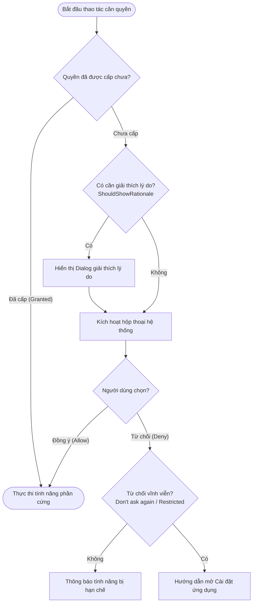

# 2. Permission Manager

Xây dựng dịch vụ quản lý quyền (**PermissionManager**) độc lập, có thể tái sử dụng trên cả Android và iOS, phục vụ cho các tính năng phần cứng như Bluetooth BLE, Camera và Media.

---

## 1. Yêu cầu & Khái niệm nền tảng

1. **Kiểm tra trạng thái quyền (Check Status)**: Biết được quyền hiện tại là [`Granted`](https://developer.android.com/reference/android/content/pm/PackageManager#PERMISSION_GRANTED), [`Denied`](https://developer.android.com/reference/android/content/pm/PackageManager#PERMISSION_DENIED), hay [`Not Determined`](https://developer.apple.com/documentation/avfoundation/avauthorizationstatus/notdetermined).
2. **Yêu cầu cấp quyền (Request Permission)**: Kích hoạt hộp thoại xin quyền của hệ thống.
3. **Xử lý các nhánh kết quả**:
   - **Được cấp (Granted)**: Tiếp tục thực thi tính năng.
   - **Bị từ chối (Denied)**: Thông báo lý do người dùng cần cấp quyền để sử dụng tính năng.
   - **Bị từ chối vĩnh viễn (Permanently Denied / Don't Ask Again)**: Hướng dẫn người dùng mở trang Cài đặt (Settings) của ứng dụng.
4. **Hỗ trợ xin một lúc nhiều quyền (Multiple Permissions)**: Ví dụ Bluetooth trên Android 12+ yêu cầu cả [`BLUETOOTH_SCAN`](https://developer.android.com/reference/android/Manifest.permission#BLUETOOTH_SCAN) và [`BLUETOOTH_CONNECT`](https://developer.android.com/reference/android/Manifest.permission#BLUETOOTH_CONNECT).

---

## 2. Kiến trúc & Luồng xử lý quyền (Flowchart)



---

## 3. Đặc tả Public Interface (Kotlin & Swift)

::: code-group
```kotlin [Kotlin (Android - PermissionManager.kt)]
interface PermissionManager {
    fun checkPermission(permission: String): Boolean
    fun requestPermission(activity: ComponentActivity, permission: String, onResult: (Boolean) -> Unit)
    fun checkMultiplePermissions(permissions: List<String>): Map<String, Boolean>
    fun requestMultiplePermissions(
        activity: ComponentActivity, 
        permissions: List<String>, 
        onResult: (Map<String, Boolean>) -> Unit
    )
}
```

```swift [Swift (iOS - PermissionManager.swift)]
enum PermissionType {
    case bluetooth
    case camera
    case photoLibrary
}

protocol PermissionManagerProtocol {
    func checkPermission(type: PermissionType) -> PermissionStatus
    func requestPermission(type: PermissionType, completion: @escaping (Bool) -> Void)
    func openAppSettings()
}
```
:::

---

## 4. So sánh mã nguồn thực thi Native

### Điều hướng người dùng mở Cài đặt ứng dụng (Open App Settings)

Khi người dùng từ chối vĩnh viễn quyền truy cập (hoặc chọn "Don't ask again"), ứng dụng phải điều hướng sang trang Settings của OS để người dùng bật thủ công:

::: code-group
```kotlin [Kotlin (Android - Mở Settings)]
val intent = Intent(Settings.ACTION_APPLICATION_DETAILS_SETTINGS).apply {
    data = Uri.fromParts("package", packageName, null)
    flags = Intent.FLAG_ACTIVITY_NEW_TASK
}
context.startActivity(intent)
```

```swift [Swift (iOS - Mở Settings)]
if let url = URL(string: UIApplication.openSettingsURLString),
   UIApplication.shared.canOpenURL(url) {
    UIApplication.shared.open(url, options: [:], completionHandler: nil)
}
```
:::

---

## 5. Tài liệu tra cứu tham chiếu (Ref Docs)

### <span class="badge-android">Android Reference Documentation</span>

#### 1. Quản lý quyền Runtime (AndroidX)
- [Request App Permissions Guide](https://developer.android.com/training/permissions/requesting): Tài liệu chính thức về cách yêu cầu quyền trên Android.
- [Activity Result Contracts for Permissions](https://developer.android.com/training/permissions/evaluating): Sử dụng [`ActivityResultContracts.RequestPermission()`](https://developer.android.com/reference/androidx/activity/result/contract/ActivityResultContracts.RequestPermission) và [`RequestMultiplePermissions()`](https://developer.android.com/reference/androidx/activity/result/contract/ActivityResultContracts.RequestMultiplePermissions).

#### 2. Bảng kê khai AndroidManifest.xml
Tùy theo phiên bản Android, quyền Bluetooth và Camera được khai báo khác nhau:

```xml
<!-- Quyền Camera -->
<uses-permission android:name="android.permission.CAMERA" />

<!-- Quyền Bluetooth trên Android 12 (API 31) trở lên -->
<uses-permission android:name="android.permission.BLUETOOTH_SCAN"
    android:usesPermissionFlags="neverForLocation" />
<uses-permission android:name="android.permission.BLUETOOTH_CONNECT" />

<!-- Quyền Bluetooth cho Android 11 (API 30) trở xuống -->
<uses-permission android:name="android.permission.BLUETOOTH" android:maxSdkVersion="30" />
<uses-permission android:name="android.permission.BLUETOOTH_ADMIN" android:maxSdkVersion="30" />
<uses-permission android:name="android.permission.ACCESS_FINE_LOCATION" />
```

---

### <span class="badge-ios">iOS Reference Documentation</span>

#### 1. Privacy Keys bắt buộc trong Info.plist
Trên iOS, nếu gọi API phần cứng mà thiếu khóa mô tả trong [`Info.plist`](https://developer.apple.com/documentation/bundleresources/information_property_list), ứng dụng sẽ **bị hệ điều hành lập tức terminate (crash)**:
- [`NSBluetoothAlwaysUsageDescription`](https://developer.apple.com/documentation/bundleresources/information_property_list/nsbluetoothalwaysusagedescription): Lý do ứng dụng cần quét và kết nối thiết bị Bluetooth.
- [`NSCameraUsageDescription`](https://developer.apple.com/documentation/bundleresources/information_property_list/nscamerausagedescription): Lý do ứng dụng cần sử dụng Camera để chụp ảnh.
- [`NSPhotoLibraryUsageDescription`](https://developer.apple.com/documentation/bundleresources/information_property_list/nsphotolibraryusagedescription): Lý do ứng dụng cần truy cập thư viện ảnh của người dùng.

#### 2. Kiểm tra trạng thái cấp quyền từng Framework
- **Bluetooth**: [CBManager.authorization](https://developer.apple.com/documentation/corebluetooth/cbmanagerauthorization) (hoặc [`CBCentralManager.authorization`](https://developer.apple.com/documentation/corebluetooth/cbcentralmanager/3153087-authorization)).
- **Camera**: [AVCaptureDevice.authorizationStatus](https://developer.apple.com/documentation/avfoundation/avcapturedevice/1624613-authorizationstatus).
- **Thư viện ảnh**: [PHPhotoLibrary.authorizationStatus](https://developer.apple.com/documentation/photokit/phphotolibrary/1620737-authorizationstatus).
