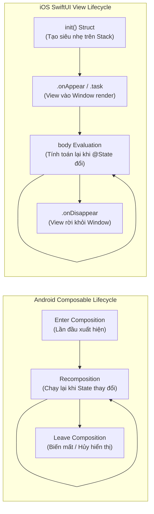
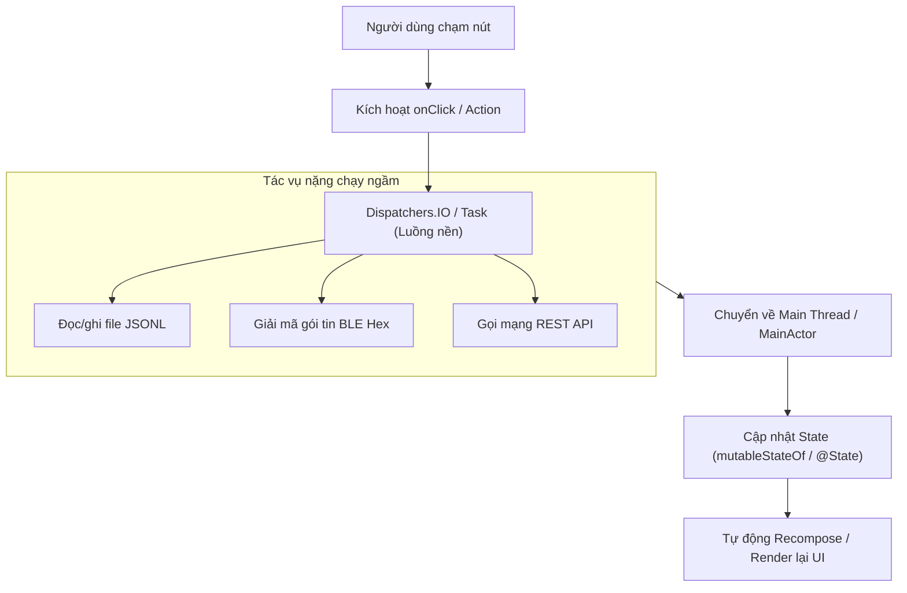

# 1. Native UI & Async Update (Jetpack Compose & SwiftUI)

Module này rèn luyện kỹ năng xây dựng giao diện Native hiện đại bằng chuẩn **Declarative UI** (Khai báo giao diện theo trạng thái) với **Jetpack Compose** trên Android và **SwiftUI** trên iOS, cùng kỹ thuật tối quan trọng: **cập nhật giao diện từ kết quả bất đồng bộ mà không làm treo ứng dụng**.

Đặc biệt, chương này cung cấp **Cẩm nang chuyển đổi toàn diện (Migration Masterclass) từ Ionic / Capacitor sang Native**, bao gồm bảng ánh xạ chi tiết 25+ linh kiện, so sánh cơ chế điều hướng, quản lý trạng thái, vòng đời và phân tích sâu về hiệu năng luồng.

---

## 1. Yêu cầu & Khái niệm nền tảng

::: details 🎨 Bảng Tra Cứu Ánh Xạ: Ionic Components ➔ Native Declarative UI (Dành riêng cho Designer & UI/UX) [Click để mở]

> [!NOTE] DÀNH CHO DESIGNER & FRONTEND MIGRATION
> Hệ thống tra cứu quy đổi **38 linh kiện** từ **Ionic Framework** sang **Android Jetpack Compose** và **iOS SwiftUI** dành cho **UI/UX Designer** và đội ngũ Frontend. Bạn có thể **tìm kiếm nhanh**, **chọn lọc theo nhóm**, hoặc chuyển đổi giữa **Dạng Thẻ (Cards)** và **Dạng Bảng (Table)** không bị tràn màn hình.

<IonicMappingTable />

:::

---

### 1.1. Tư duy Trạng thái & Cơ chế Dựng lại Giao diện (State & Recomposition)

Trong các framework Web (Angular, React, Vue), việc cập nhật dữ liệu thường dựa vào cơ chế Dirty Checking hoặc Virtual DOM. Trong Native Declarative UI, giao diện được điều khiển hoàn toàn bởi luồng dữ liệu một chiều (**Unidirectional Data Flow**):

```mermaid
graph TD
    subgraph IonicWorld ["1. Thế giới Ionic / Angular (Web Event Loop)"]
        W1["Biến: name = ''"] --> W2["HTML: [(ngModel)]='name'"]
        W2 --> W3["Change Detection quét toàn bộ cây DOM"]
        W3 --> W4["Browser Layout & Paint lại WebView"]
    end

    subgraph ComposeWorld ["2. Thế giới Android Jetpack Compose"]
        C1["var name by remember { mutableStateOf('') }"] --> C2["OutlinedTextField(value = name, onValueChange = ...)"]
        C2 --> C3["Smart Recomposition: Chỉ tính toán lại composable đọc name"]
        C3 --> C4["Gửi trực tiếp lệnh vẽ tới GPU qua Skia/Vulkan"]
    end

    subgraph SwiftUIWorld ["3. Thế giới iOS SwiftUI"]
        S1["@State private var name = ''"] --> S2["TextField('Nhập tên', text: $name)"]
        S2 --> S3["View Invalidation: Diff trạng thái cây View"]
        S3 --> S4["Gửi trực tiếp lệnh vẽ tới GPU qua Metal"]
    end
```



#### Quy đổi cú pháp Data-Binding quen thuộc:
1. **Binding 2 chiều (Two-Way Binding)**:
   - **Ionic (Angular)**: `[(ngModel)]="deviceInput"`
   - **Jetpack Compose**: Chia tách rõ ràng giữa Giá trị hiện tại và Hàm xử lý sự kiện:
     ```kotlin
     var deviceInput by remember { mutableStateOf("") }
     OutlinedTextField(value = deviceInput, onValueChange = { deviceInput = it })
     ```
   - **SwiftUI**: Dùng tiền tố `$` để truyền tham chiếu Binding:
     ```swift
     @State private var deviceInput = ""
     TextField("Tên thiết bị", text: $deviceInput)
     ```

2. **Danh sách phản ứng (Reactive Arrays)**:
   - **Ionic**: `devices = ['Dev1', 'Dev2']; devices.push('Dev3');`
   - **Jetpack Compose**: Bắt buộc dùng `mutableStateListOf()` để Compose phát hiện khi thêm/bớt phần tử:
     ```kotlin
     val devices = remember { mutableStateListOf("Dev1", "Dev2") }
     devices.add("Dev3") // Tự động kích hoạt LazyColumn vẽ thêm phần tử mới
     ```
   - **SwiftUI**: Dùng mảng thông thường bọc bởi `@State`:
     ```swift
     @State private var devices = ["Dev1", "Dev2"]
     devices.append("Dev3") // Tự động kích hoạt List render lại
     ```

---

### 1.2. So sánh Vòng đời (Lifecycle) & Điều hướng (Navigation)

Sự khác biệt về vòng đời là rào cản tư duy lớn nhất khi chuyển từ Ionic/Web sang Native Declarative UI:
- **Ionic**: Giao diện gắn liền với đối tượng Class và các Node DOM được lưu trong bộ đệm (DOM Caching). Khi chuyển trang, Node DOM cũ vẫn còn lưu trong bộ nhớ.
- **Jetpack Compose & SwiftUI**: Giao diện là **Hàm (Function) hoặc Cấu trúc (Struct) biểu diễn trạng thái**. Chúng không có vòng đời "Class Instance" kiểu truyền thống (`onCreate`, `onDestroy`), mà tuân theo chu trình **Dựng hình (Composition/Rendering) ➔ Dựng lại khi State đổi (Recomposition/Evaluation) ➔ Rời khỏi màn hình (Disposal)**.



#### 1. Bảng quy đổi toàn diện các Sự kiện Vòng đời & Tác vụ

| Giai đoạn vòng đời | <span class="badge-ionic">Ionic / Angular</span> | <span class="badge-android">Jetpack Compose</span> | <span class="badge-ios">SwiftUI</span> | Ý nghĩa & Hành vi thực tế |
| :--- | :--- | :--- | :--- | :--- |
| **Khởi tạo lần đầu** | `ngOnInit` / `componentDidMount` | `LaunchedEffect(Unit) { ... }` | `.task { ... }` hoặc `.onAppear { ... }` | Chỉ chạy đúng 1 lần duy nhất khi màn hình được tạo |
| **Màn hình vừa hiển thị** | `ionViewDidEnter` | `LifecycleEventEffect(Lifecycle.Event.ON_RESUME)` | `.onAppear { ... }` | Chạy mỗi khi màn hình hiển thị trực quan trước mắt người dùng |
| **Màn hình bị che khuất / Rời đi** | `ionViewWillLeave` | `LifecycleEventEffect(Lifecycle.Event.ON_PAUSE)` | `.onDisappear { ... }` | Kích hoạt khi chuyển sang màn hình khác hoặc thu nhỏ app |
| **Tác vụ Async tự hủy (Auto-Cancel)** | RxJS `takeUntil(destroy$)` | `LaunchedEffect(key) { ... }` | `.task { await ... }` | Coroutine/Task tự động bị dừng nếu Composable/View bị hủy trước khi hoàn tất |
| **Dọn dẹp tài nguyên (Teardown)** | `ngOnDestroy` | `DisposableEffect(key) { onDispose { ... } }` | `.onDisappear { ... }` | Bắt buộc để unregister BLE Scanner, hủy Broadcast Receiver, đóng File Handle |
| **Lắng nghe Vòng đời App (Foreground/Background)** | Capacitor `App.addListener('appStateChange')` | `LifecycleEventEffect` hoặc `ProcessLifecycleOwner` | `@Environment(\.scenePhase) var phase` (`.active`, `.background`) | Nhận biết khi người dùng ấn nút Home, chuyển đa nhiệm hoặc quay lại ứng dụng |
| **Lắng nghe luồng dữ liệu an toàn** | Async Pipe `\| async` | `.collectAsStateWithLifecycle()` | Dùng `@Observable` / `@StateObject` + `.task` | Tự động ngừng nhận dữ liệu khi app ở chế độ nền nhằm tiết kiệm pin & RAM |
| **Điều hướng chuyển trang** | `navCtrl.navigateForward('/detail')` | `navController.navigate("detail")` | `NavigationLink(value: ...)` / `path.append(...)` | Đẩy một màn hình mới vào ngăn xếp điều hướng (Navigation Stack) |
| **Quay lại trang trước** | `navCtrl.back()` | `navController.popBackStack()` | `dismiss()` / `path.removeLast()` | Rút màn hình hiện tại ra khỏi ngăn xếp |

#### 2. So sánh mã nguồn quản lý Vòng đời & Side-Effects

::: code-group
```kotlin [Kotlin (Android - Jetpack Compose Lifecycle)]
@Composable
fun DeviceDetailScreen(deviceId: String, onBack: () -> Unit) {
    val context = LocalContext.current
    var isConnected by remember { mutableStateOf(false) }

    // 1. Tác vụ khởi tạo bất đồng bộ (Chạy 1 lần khi vào màn hình, tự cancel nếu rời đi)
    LaunchedEffect(deviceId) {
        // Gọi API hoặc kết nối BLE thiết bị
        isConnected = true
    }

    // 2. Đăng ký & Giải phóng tài nguyên phần cứng (Bắt buộc dùng DisposableEffect)
    DisposableEffect(deviceId) {
        val receiver = registerHardwareSensorListener(context, deviceId)

        // onDispose chạy ngay khi Composable rời khỏi Composition (Màn hình đóng)
        onDispose {
            unregisterHardwareSensorListener(context, receiver)
        }
    }

    // 3. Lắng nghe trạng thái Resume / Pause của Activity hệ thống
    LifecycleResumeEffect(Unit) {
        startSensorStreaming()
        onPauseOrDispose {
            stopSensorStreaming()
        }
    }

    Scaffold(
        topBar = {
            TopAppBar(
                title = { Text("Thiết bị: $deviceId") },
                navigationIcon = {
                    IconButton(onClick = onBack) {
                        Icon(Icons.Default.ArrowBack, contentDescription = "Back")
                    }
                }
            )
        }
    ) { innerPadding ->
        Text(
            text = if (isConnected) "Đang kết nối" else "Chờ kết nối...",
            modifier = Modifier.padding(innerPadding)
        )
    }
}
```

```swift [Swift (iOS - SwiftUI View Lifecycle)]
struct DeviceDetailView: View {
    let deviceId: String
    @Environment(\.dismiss) private var dismiss
    @Environment(\.scenePhase) private var scenePhase // Lắng nghe Foreground / Background của App
    @State private var isConnected = false

    var body: some View {
        VStack(spacing: 20) {
            Text(isConnected ? "Đang kết nối" : "Chờ kết nối...")
                .font(.headline)

            Button("Đóng màn hình") {
                dismiss() // Tương đương navController.popBackStack()
            }
        }
        .navigationTitle("Thiết bị: \(deviceId)")
        // 1. Tác vụ async bất đồng bộ (Chạy khi xuất hiện, tự động hủy khi View biến mất)
        .task(id: deviceId) {
            // Giả lập kết nối thiết bị BLE qua Swift Concurrency
            try? await Task.sleep(nanoseconds: 500_000_000)
            isConnected = true
        }
        // 2. Bắt sự kiện xuất hiện và biến mất để bật/tắt cảm biến phần cứng
        .onAppear {
            startHardwareSensorStream(id: deviceId)
        }
        .onDisappear {
            stopHardwareSensorStream(id: deviceId)
        }
        // 3. Phản ứng với trạng thái Ứng dụng (Vào nền / Quay lại)
        .onChange(of: scenePhase) { _, newPhase in
            switch newPhase {
            case .active:
                print("App vào Foreground -> Khôi phục quét BLE")
            case .background:
                print("App vào Background -> Giảm tần suất đọc")
            case .inactive:
                break
            @unknown default:
                break
            }
        }
    }
}
```
:::

#### 3. Ba cạm bẫy sống còn (Pitfalls) khi chuyển từ Ionic sang Native:
1. ⚠️ **Bẫy gọi API trực tiếp trong thân hàm UI**:
   - *Sai*: Trong Compose hoặc SwiftUI, nếu bạn viết `apiClient.fetchData()` trực tiếp trong thân hàm `@Composable` hoặc thuộc tính `var body: some View`, mã lệnh này sẽ bị **chạy lại vô số lần** mỗi khi màn hình vẽ lại (Recomposition)!
   - *Đúng*: Luôn bọc các tác vụ gọi mạng/tính toán nặng trong `LaunchedEffect(Unit) { ... }` (Android) hoặc `.task { ... }` (iOS).
2. ⚠️ **Bẫy bộ nhớ đệm trang (DOM Caching vs Stack Re-creation)**:
   - Trong Ionic, khi bạn `navigateForward`, màn hình cũ chỉ bị ẩn đi bằng CSS chứ không bị hủy.
   - Trong Native Navigation, màn hình trước đó nằm trong Backstack. Nếu bạn không dùng `rememberSaveable` (Compose) hoặc State Object phù hợp, việc xoay màn hình hoặc hệ thống thu hồi bộ nhớ (Process Death) có thể làm mất dữ liệu người dùng đang nhập dở.
3. ⚠️ **Bẫy quên hủy Listener (Memory Leak)**:
   - Khi đăng ký các sự kiện phần cứng (BLE Notifications, Location updates), nếu rời khỏi màn hình mà không unregister trong `onDispose` hoặc `.onDisappear`, luồng dữ liệu sẽ tiếp tục chạy ngầm, làm rò rỉ RAM và nhanh chóng cạn kiệt pin thiết bị.

---

### 1.3. Tại sao Native vượt trội hoàn toàn so với Ionic WebView về Hiệu năng?

::: danger SỰ KHÁC BIỆT SỐNG CÒN GIỮA WEB VIEW & NATIVE ENGINE
1. **Rào cản Cầu nối Capacitor (Bridge Serialization Overhead)**:
   - Trong Ionic, khi bạn gọi một hàm phần cứng (ví dụ: quét BLE hoặc đọc dung lượng pin qua Capacitor Plugin), dữ liệu phải trải qua quy trình:
     $$\text{JavaScript} \xrightarrow{\text{JSON Serialize}} \text{Capacitor Bridge} \xrightarrow{\text{Java / Swift Call}} \text{Hardware API} \xrightarrow{\text{JSON Serialize}} \text{JavaScript Callback}$$
   - Việc chuyển đổi mảng byte nhị phân của BLE thành chuỗi Base64 / JSON làm chậm từ **5ms đến 25ms** cho mỗi lần đọc. Nếu thiết bị phát liên tục 50 gói tin/giây, WebView sẽ bị quá tải hoàn toàn.
   - **Trong Native**: Không hề có cầu nối trung gian. Hàm gọi trực tiếp hàm (Direct function call), mảng byte được xử lý nguyên khối trong bộ nhớ RAM (`ByteArray` / `Data`) với độ trễ bằng **0 mili-giây**!
2. **Đơn luồng (Single Thread) vs Đa luồng thực thụ (True Multi-Threading)**:
   - Trong Ionic, toàn bộ logic tính toán và xử lý UI đều tranh chấp nhau trên **một luồng duy nhất của trình duyệt (Browser Main Event Loop)**. Khi bạn parse một file JSONL lớn, màn hình sẽ bị đơ giật ngay lập tức.
   - Trong Native, bạn có các luồng chạy song song trên nhiều lõi CPU ([`Dispatchers.IO`](https://kotlinlang.org/api/kotlinx.coroutines/kotlinx-coroutines-core/kotlinx.coroutines/-dispatchers/-i-o.html) và [`Task.detached`](https://developer.apple.com/documentation/swift/task/detached(priority:operation:))). Luồng giao diện (Main UI Thread) luôn được bảo vệ để phục vụ thao tác chạm và animation của người dùng ở tốc độ 120Hz.
:::

---

## 2. Kiến trúc & Quy tắc cập nhật Main Thread

::: danger NGUYÊN TẮC BẤT DI BẤT DỊCH
**Chỉ Main Thread (UI Thread) mới được phép cập nhật State của Giao diện.**
- Nếu thay đổi biến State hoặc chạm vào UI hierarchy từ Background Thread:
  - **Android**: Sẽ văng lỗi [`CalledFromWrongThreadException`](https://developer.android.com/reference/android/view/ViewRootImpl.CalledFromWrongThreadException) hoặc gây bất đồng bộ trong cây Recomposition.
  - **iOS**: Gây ra crash, glitch giật màn hình hoặc vi phạm Thread Sanitizer / Main Thread Checker cảnh báo tím trong Xcode.
:::



---

## 3. So sánh mã nguồn thực thi: Ionic vs Jetpack Compose vs SwiftUI

Dưới đây là cùng một bài toán: **Bấm nút ➔ Gọi tác vụ nền ➔ Hiện Spinner ➔ Cập nhật giao diện** được viết bằng 3 công nghệ để bạn dễ dàng đối chiếu:

::: code-group
```html [Ionic / Angular (HTML & TypeScript)]
<!-- 1. Giao diện template HTML (Ionic) -->
<ion-content class="ion-padding">
  <div class="container">
    <h2>{{ statusText }}</h2>
    
    <ion-spinner *ngIf="isLoading"></ion-spinner>
    
    <ion-button [disabled]="isLoading" (click)="startTask()">
      Bắt đầu tác vụ
    </ion-button>
  </div>
</ion-content>

<!-- 2. Logic điều khiển (TypeScript) -->
<script>
export class AsyncPage {
  statusText = 'Sẵn sàng';
  isLoading = false;

  async startTask() {
    this.isLoading = true;
    this.statusText = 'Đang xử lý ở nền...';

    // Giả lập tác vụ (vẫn nằm trong Web Event Loop)
    await new Promise(resolve => setTimeout(resolve, 1500));

    this.isLoading = false;
    this.statusText = 'Hoàn tất xử lý tác vụ!';
  }
}
</script>
```

```kotlin [Kotlin (Android - Jetpack Compose)]
@Composable
fun AsyncUpdateScreen() {
    // 1. Khởi tạo State (Tương đương biến component trong Angular)
    var statusText by remember { mutableStateOf("Sẵn sàng") }
    var isLoading by remember { mutableStateOf(false) }
    val scope = rememberCoroutineScope()

    Column(
        modifier = Modifier
            .fillMaxSize()
            .padding(16.dp),
        horizontalAlignment = Alignment.CenterHorizontally,
        verticalArrangement = Arrangement.Center
    ) {
        // Tương đương <ion-text><h2>{{ statusText }}</h2></ion-text>
        Text(text = statusText, style = MaterialTheme.typography.titleMedium)

        // Tương đương <ion-spinner *ngIf="isLoading"></ion-spinner>
        if (isLoading) {
            Spacer(modifier = Modifier.height(16.dp))
            CircularProgressIndicator()
        }

        Spacer(modifier = Modifier.height(16.dp))

        // Tương đương <ion-button (click)="startTask()">
        Button(
            enabled = !isLoading,
            onClick = {
                scope.launch {
                    isLoading = true
                    statusText = "Đang xử lý ở luồng nền..."

                    // 1. Tác vụ nặng chạy trên luồng nền IO thực thụ
                    withContext(Dispatchers.IO) {
                        Thread.sleep(1500)
                    }

                    // 2. Cập nhật State trên Main Thread -> Compose tự recompose
                    isLoading = false
                    statusText = "Hoàn tất xử lý tác vụ!"
                }
            }
        ) {
            Text("Bắt đầu tác vụ")
        }
    }
}
```

```swift [Swift (iOS - SwiftUI)]
struct AsyncUpdateView: View {
    // 1. Khởi tạo State (Tương đương @State trong SwiftUI)
    @State private var statusText = "Sẵn sàng"
    @State private var isLoading = false

    var body: some View {
        VStack(spacing: 16) {
            // Tương đương <ion-text><h2>{{ statusText }}</h2></ion-text>
            Text(statusText)
                .font(.headline)

            // Tương đương <ion-spinner *ngIf="isLoading"></ion-spinner>
            if isLoading {
                ProgressView()
            }

            // Tương đương <ion-button (click)="startTask()">
            Button("Bắt đầu tác vụ") {
                Task {
                    isLoading = true
                    statusText = "Đang xử lý ở luồng nền..."

                    // 1. Tác vụ nặng chạy ngầm bằng Task bất đồng bộ
                    try? await Task.sleep(nanoseconds: 1_500_000_000)

                    // 2. Cập nhật State trên MainActor -> SwiftUI tự render lại
                    await MainActor.run {
                        isLoading = false
                        statusText = "Hoàn tất xử lý tác vụ!"
                    }
                }
            }
            .disabled(isLoading)
            .buttonStyle(.borderedProminent)
        }
        .padding()
    }
}
```
:::

---

## 4. Tài liệu tra cứu tham chiếu (Ref Docs)

### <span class="badge-android">Android Reference Documentation</span>

#### 1. Jetpack Compose Foundation
- [Jetpack Compose Official Tutorial](https://developer.android.com/develop/ui/compose/tutorial): Cẩm nang bắt đầu xây dựng UI với Compose từ Google.
- [State and Jetpack Compose Guide](https://developer.android.com/develop/ui/compose/state): Quản lý State với [`remember`](https://developer.android.com/reference/kotlin/androidx/compose/runtime/package-summary#remember(kotlin.Function0)) và [`mutableStateOf`](https://developer.android.com/reference/kotlin/androidx/compose/runtime/package-summary#mutableStateOf(kotlin.Any,androidx.compose.runtime.SnapshotMutationPolicy)).
- [Compose Layouts (Column, Row, Box)](https://developer.android.com/develop/ui/compose/layouts/basics): Tổ chức layout không dùng XML.
- [Lazy Lists in Compose](https://developer.android.com/develop/ui/compose/lists): Xây dựng danh sách cuộn mượt mà thay thế RecyclerView.

#### 2. Coroutines & State trong Compose
- [Kotlin Coroutines with Compose](https://developer.android.com/develop/ui/compose/side-effects): Quản lý luồng bất đồng bộ với [`LaunchedEffect`](https://developer.android.com/reference/kotlin/androidx/compose/runtime/package-summary#LaunchedEffect(kotlin.Any,kotlin.coroutines.SuspendFunction1)) và `rememberCoroutineScope`.

---

### <span class="badge-ios">iOS Reference Documentation</span>

#### 1. SwiftUI Framework
- [Apple SwiftUI Documentation](https://developer.apple.com/documentation/swiftui): Tài liệu chính thức từ Apple về framework giao diện khai báo.
- [State and Data Flow in SwiftUI](https://developer.apple.com/documentation/swiftui/managing-model-data-in-your-app): Quản lý State với `@State` và `@Binding`.
- [VStack, HStack, ZStack](https://developer.apple.com/documentation/swiftui/vstack): Các khối layout tiêu chuẩn trong SwiftUI.

#### 2. Swift Concurrency & MainActor
- [The Swift Concurrency Book](https://docs.swift.org/swift-book/documentation/the-swift-programming-language/concurrency/): Hướng dẫn chuẩn về [`async/await`](https://docs.swift.org/swift-book/documentation/the-swift-programming-language/concurrency/), [`Task`](https://developer.apple.com/documentation/swift/task).
- [MainActor API Reference](https://developer.apple.com/documentation/swift/mainactor): Đảm bảo cập nhật State trên Main Thread.
